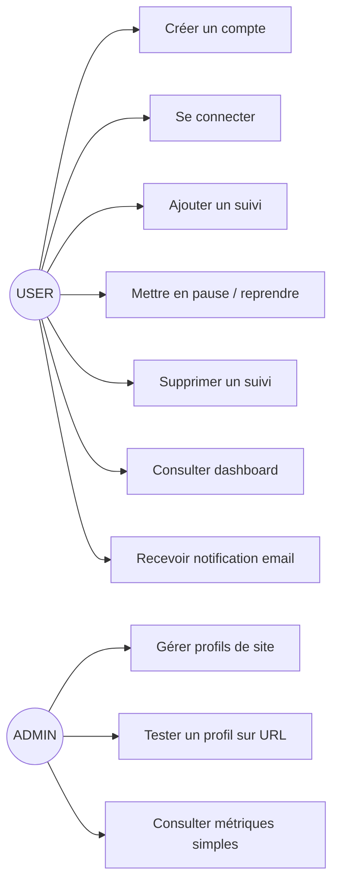

# Nova - UML - Cas d’utilisation

## Acteurs
- **USER**
- **ADMIN**

## Diagramme (Mermaid)

```mermaid
flowchart LR
  USER((USER))
  ADMIN((ADMIN))

  UC1[Créer un compte]
  UC2[Se connecter]
  UC3[Ajouter un suivi]
  UC4[Mettre en pause / reprendre]
  UC5[Supprimer un suivi]
  UC6[Consulter dashboard]
  UC7[Recevoir notification email]

  UC8[Gérer profils de site]
  UC9[Tester un profil sur URL]
  UC10[Consulter métriques simples]

  USER --> UC1
  USER --> UC2
  USER --> UC3
  USER --> UC4
  USER --> UC5
  USER --> UC6
  USER --> UC7

  ADMIN --> UC8
  ADMIN --> UC9
  ADMIN --> UC10
```
