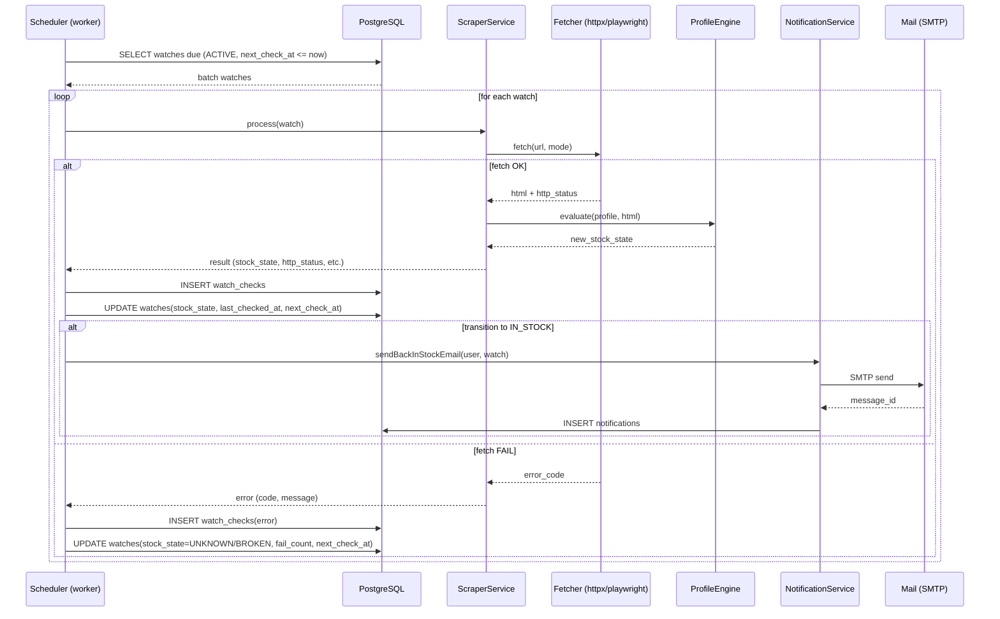
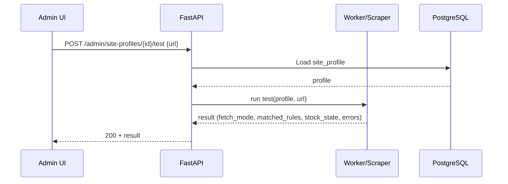

# Nova - UML - Séquences

## Séquence 1 — Contrôle stock + notification

```mermaid
sequenceDiagram
  participant S as Scheduler (worker)
  participant DB as PostgreSQL
  participant W as ScraperService
  participant F as Fetcher (httpx/playwright)
  participant P as ProfileEngine
  participant N as NotificationService
  participant M as Mail (SMTP)

  S->>DB: SELECT watches due (ACTIVE, next_check_at <= now)
  DB-->>S: batch watches

  loop for each watch
    S->>W: process(watch)
    W->>F: fetch(url, mode)
    alt fetch OK
      F-->>W: html + http_status
      W->>P: evaluate(profile, html)
      P-->>W: new_stock_state
      W-->>S: result (stock_state, http_status, etc.)
      
      S->>DB: INSERT watch_checks
      S->>DB: UPDATE watches(stock_state, last_checked_at, next_check_at)

      alt transition to IN_STOCK
        S->>N: sendBackInStockEmail(user, watch)
        N->>M: SMTP send
        M-->>N: message_id
        N->>DB: INSERT notifications
      end

    else fetch FAIL
      F-->>W: error_code
      W-->>S: error (code, message)
      S->>DB: INSERT watch_checks(error)
      S->>DB: UPDATE watches(stock_state=UNKNOWN/BROKEN, fail_count, next_check_at)
    end
  end
```

## Séquence 2 — Admin “Test profil sur URL”

```mermaid
sequenceDiagram
  participant A as Admin UI
  participant API as FastAPI
  participant W as Worker/Scraper
  participant DB as PostgreSQL

  A->>API: POST /admin/site-profiles/{id}/test {url}
  API->>DB: Load site_profile
  DB-->>API: profile
  API->>W: run test(profile, url)
  W-->>API: result (fetch_mode, matched_rules, stock_state, errors)
  API-->>A: 200 + result
```
