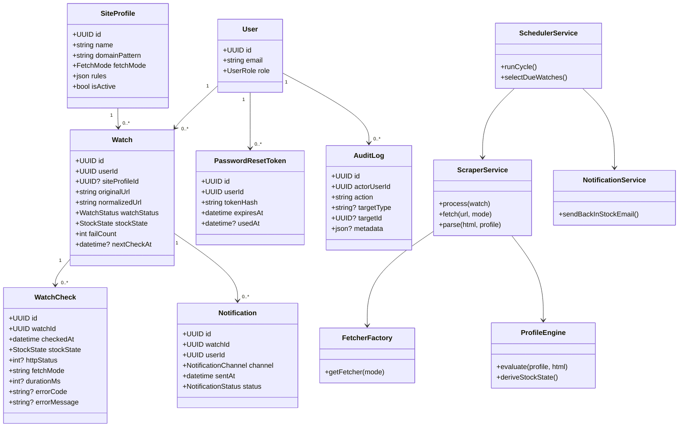

# Nova - UML - Diagramme de classes (métier + services)

## Objectif
Montrer la séparation : **Domain (modèles)** / **Services** / **Infra**.

## Diagramme (Mermaid)

```mermaid
classDiagram
  class User {
    +UUID id
    +string email
    +UserRole role
  }

  class Watch {
    +UUID id
    +UUID userId
    +UUID? siteProfileId
    +string originalUrl
    +string normalizedUrl
    +WatchStatus watchStatus
    +StockState stockState
    +int failCount
    +datetime? nextCheckAt
  }

  class SiteProfile {
    +UUID id
    +string name
    +string domainPattern
    +FetchMode fetchMode
    +json rules
    +bool isActive
  }

  class WatchCheck {
    +UUID id
    +UUID watchId
    +datetime checkedAt
    +StockState stockState
    +int? httpStatus
    +string fetchMode
    +int? durationMs
    +string? errorCode
    +string? errorMessage
  }

  class Notification {
    +UUID id
    +UUID watchId
    +UUID userId
    +NotificationChannel channel
    +datetime sentAt
    +NotificationStatus status
  }

  class PasswordResetToken {
    +UUID id
    +UUID userId
    +string tokenHash
    +datetime expiresAt
    +datetime? usedAt
  }

  class AuditLog {
    +UUID id
    +UUID actorUserId
    +string action
    +string? targetType
    +UUID? targetId
    +json? metadata
  }

  class SchedulerService {
    +runCycle()
    +selectDueWatches()
  }

  class ScraperService {
    +process(watch)
    +fetch(url, mode)
    +parse(html, profile)
  }

  class FetcherFactory {
    +getFetcher(mode)
  }

  class ProfileEngine {
    +evaluate(profile, html)
    +deriveStockState()
  }

  class NotificationService {
    +sendBackInStockEmail()
  }

  User "1" --> "0..*" Watch
  User "1" --> "0..*" PasswordResetToken
  User "1" --> "0..*" AuditLog
  SiteProfile "1" --> "0..*" Watch
  Watch "1" --> "0..*" WatchCheck
  Watch "1" --> "0..*" Notification

  SchedulerService --> ScraperService
  ScraperService --> FetcherFactory
  ScraperService --> ProfileEngine
  SchedulerService --> NotificationService
```
